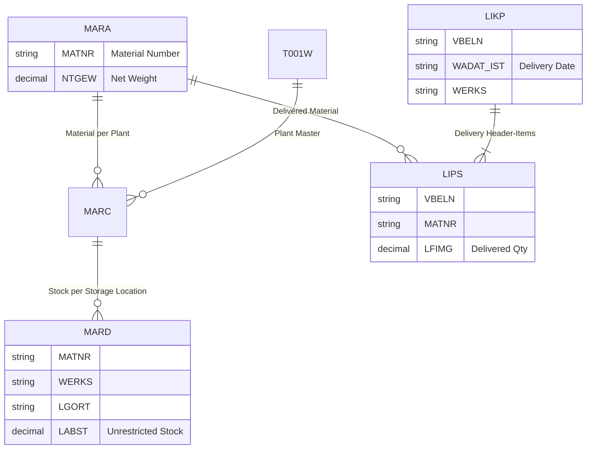

# 🧭 Siemens Healthineers — Data Analytics Case Study  
### Author: [Khurshid Uktamov](https://www.linkedin.com/in/khurshid-uktamov/)  
> A practical demonstration of how I would approach a real-world SAP data analytics problem — from understanding the request to designing the model and SQL logic.

---

## 🧩 Case Overview

## 🚀 Implementation Roadmap

| Step | Description | Tools / Notes |
|------|--------------|---------------|
| **1️⃣ Requirement Gathering** | Workshop with planning and logistics teams | Miro / Confluence |
| **2️⃣ Data Extraction** | Connect to SAP tables via OData / SAP BW | SAP RFC / PyRFC / Azure Data Factory |
| **3️⃣ Transformation** | Filter, join, and aggregate stock and delivery data | SQL / PySpark / dbt |
| **4️⃣ Data Modeling** | Create fact + dimension structure | Snowflake / Synapse / Power BI model |
| **5️⃣ Validation** | Cross-check totals with SAP reports | Excel pivot & reconciliation |
| **6️⃣ Visualization** | Interactive dashboard (KPIs, trends, maps) | Power BI / Streamlit |
| **7️⃣ Automation** | Schedule data refresh pipeline | Azure Data Factory or SAP Job Scheduler |
| **8️⃣ Go-Live** | Documentation + user training | SharePoint + Teams |

---

**Business request:**  
Planning teams want to analyze:
- **Unrestricted stock per plant and storage location**
- **Number of deliveries per day**
- **For all materials with a net weight > 100 kg**

---

## 🎯 Business Understanding & Stakeholder Questions

To deliver a high-impact, correct, and scalable solution, I would begin by clarifying:

| Area | Questions to Ask |
|------|------------------|
| **Objective Clarification** | • Is the goal operational visibility (daily usage) or long-term trend reporting? • How frequently should this data refresh (daily/hourly)? |
| **Scope of Materials** | • Are we using gross or net weight from MARA? • Should packaging materials be excluded? • Is 100 kg a strict cutoff or inclusive (≥ 100)? |
| **Stock Definition** | • Do we only count “Unrestricted use” stock (`LABST` in MARD) or also “Quality inspection” (`INSME`)? |
| **Delivery Logic** | • Should we include both outbound and inbound deliveries? • Do partial deliveries count separately? |
| **Data Access / Integration** | • Which SAP environment is in scope (ECC or S/4HANA)? • Do we have access via OData, SAP BW extractors, or direct SQL? |
| **Output & Delivery** | • Preferred visualization tool (Power BI / Streamlit / Tableau)? • Which KPIs or thresholds are important to the planning team? |

---

## ⚙️ Data Model (SAP Tables)

| Table | Description | Key Columns (used here) |
|--------|--------------|------------------------|
| **MARA** | General Material Master | `MATNR`, `NTGEW` (Net Weight), `GEWEI` |
| **MARC** | Plant Data for Material | `MATNR`, `WERKS` |
| **MARD** | Storage Location Data for Material | `MATNR`, `WERKS`, `LGORT`, `LABST` (Unrestricted Stock) |
| **LIKP** | Delivery Header | `VBELN`, `WADAT_IST` (Actual Delivery Date), `WERKS` |
| **LIPS** | Delivery Item | `VBELN`, `MATNR`, `LFIMG` (Delivered Quantity), `WERKS` |
| **T001W** | Plant Master | `WERKS`, `NAME1` (Plant Name), `LAND1` (Country) |

---

## 🧱 ER Diagram (SAP Data Relationships)

### 💡 Future Enhancements

- Add KPIs for **lead time**, **stock turnover**, and **delivery delays**  
- Build **predictive alerting** for low stock or high delivery load  
- Integrate **Power BI embedded dashboards** within SAP Fiori  
