# 🧭 Siemens Healthineers — Data Analytics Case Study  
### Author: [Khurshid Uktamov](https://www.linkedin.com/in/khurshid-uktamov/)  
> A practical demonstration of how I would approach a real-world SAP data analytics problem — from understanding the request to designing the model and SQL logic.

---

## 🧩 Case Overview

## 🚀 Implementation Roadmap

| Step | Description | Tools / Notes |
|------|--------------|---------------|
| **1️⃣ Requirement Gathering** | Workshop with planning and logistics teams | Miro / Confluence |
| **2️⃣ Data Extraction** | Connect to SAP tables via OData / SAP BW | SAP RFC / PyRFC / Azure Data Factory |
| **3️⃣ Transformation** | Filter, join, and aggregate stock and delivery data | SQL / PySpark / dbt |
| **4️⃣ Data Modeling** | Create fact + dimension structure | Snowflake / Synapse / Power BI model |
| **5️⃣ Validation** | Cross-check totals with SAP reports | Excel pivot & reconciliation |
| **6️⃣ Visualization** | Interactive dashboard (KPIs, trends, maps) | Power BI / Streamlit |
| **7️⃣ Automation** | Schedule data refresh pipeline | Azure Data Factory or SAP Job Scheduler |
| **8️⃣ Go-Live** | Documentation + user training | SharePoint + Teams |

---


**Business request:**  
Planning teams want to analyze:
- **Unrestricted stock per plant and storage location**
- **Number of deliveries per day**
- **For all materials with a net weight > 100 kg**

---

## 🎯 1. Business Understanding & Stakeholder Questions

To deliver a high-impact, correct, and scalable solution, I would begin by clarifying:

| Area | Questions to Ask |
|------|------------------|
| **Objective Clarification** | • Is the goal operational visibility (daily usage) or long-term trend reporting?<br>• How frequently should this data refresh (daily/hourly)? |
| **Scope of Materials** | • Are we using gross or net weight from MARA?<br>• Should packaging materials be excluded?<br>• Is 100 kg a strict cutoff or inclusive (≥ 100)? |
| **Stock Definition** | • Do we only count “Unrestricted use” stock (`LABST` in MARD) or also “Quality inspection” (`INSME`)? |
| **Delivery Logic** | • Should we include both outbound and inbound deliveries?<br>• Do partial deliveries count separately? |
| **Data Access / Integration** | • Which SAP environment is in scope (ECC or S/4HANA)?<br>• Do we have access via OData, SAP BW extractors, or direct SQL? |
| **Output & Delivery** | • Preferred visualization tool (Power BI / Streamlit / Tableau)?<br>• Which KPIs or thresholds are important to the planning team? |

---

## ⚙️ Data Model (SAP Tables)

| Table | Description | Key Columns (used here) |
|--------|--------------|------------------------|
| **MARA** | General Material Master | `MATNR`, `NTGEW` (Net Weight), `GEWEI` |
| **MARC** | Plant Data for Material | `MATNR`, `WERKS` |
| **MARD** | Storage Location Data for Material | `MATNR`, `WERKS`, `LGORT`, `LABST` (Unrestricted Stock) |
| **LIKP** | Delivery Header | `VBELN`, `WADAT_IST` (Actual Delivery Date), `WERKS` |
| **LIPS** | Delivery Item | `VBELN`, `MATNR`, `LFIMG` (Delivered Quantity), `WERKS` |
| **T001W** | Plant Master | `WERKS`, `NAME1` (Plant Name), `LAND1` (Country) |

---

## 🧱 2. ER Diagram (SAP Data Relationships) and Extraction

```mermaid
erDiagram
    %% ---------------------------
    %% Master Tables
    %% ---------------------------
    T001W {
        string WERKS "Plant ID"
        string NAME1 "Plant Name"
        string LAND1 "Country"
    }
    
    MARA {
        string MATNR "Material Number"
        decimal NTGEW "Net Weight"
        string MTART "Material Type"
    }

    %% ---------------------------
    %% Plant-specific Material Master
    %% ---------------------------
    MARC {
        string MATNR "Material Number"
        string WERKS "Plant ID"
        string BESKZ "Procurement Type"
    }

    %% ---------------------------
    %% Stock Table
    %% ---------------------------
    MARD {
        string MATNR "Material Number"
        string WERKS "Plant ID"
        string LGORT "Storage Location"
        decimal LABST "Unrestricted Stock"
        decimal INSME "Stock in Quality Inspection"
    }

    %% ---------------------------
    %% Delivery Tables
    %% ---------------------------
    LIKP {
        string VBELN "Delivery Document"
        string WADAT_IST "Actual Delivery Date"
        string WERKS "Plant ID"
    }

    LIPS {
        string VBELN "Delivery Document"
        string MATNR "Material Number"
        decimal LFIMG "Delivered Quantity"
        string WERKS "Plant ID"
    }

    %% ---------------------------
    %% Relationships
    %% ---------------------------
    MARA ||--o{ MARC : "1 material → many plant entries"
    MARC ||--o{ MARD : "1 plant-material → many storage locations"
    MARA ||--o{ LIPS : "1 material → many delivery items"
    LIKP ||--|{ LIPS : "1 delivery header → many items"
    T001W ||--o{ MARC : "1 plant → many materials"
```



### ✅ Note:
- This includes **all relevant tables and columns** for this specific problem.  


### 3️⃣ Transformation — Filter, Join & Aggregate

**Goal:** Convert raw SAP tables into meaningful datasets for analysis.  

**Actions:**
- Filter MARA for `NTGEW > 100` kg  
- Join with MARC & MARD to get stock per plant & storage location  
- Join with LIPS + LIKP to count deliveries per day  
- Aggregate by:
  - `Plant (WERKS)`  
  - `Storage Location (LGORT)`  
  - `Material (MATNR)`  
  - `Delivery Date (WADAT_IST)`  

**Tools / Techniques:**  
- SQL (HANA, T-SQL, or SAP BW queries)  
- PySpark for distributed processing on large datasets  
- dbt for modular and version-controlled transformation pipelines  

---

### 4️⃣ Data Modeling — Fact & Dimension Structure

**Goal:** Create analytics-friendly schema for dashboards and KPIs.  

**Actions:**
- **Fact Table:** `Stock_Deliveries_Fact`  
  - Measures: `Unrestricted Stock`, `Deliveries Count`  
  - Keys: `Plant`, `Storage Location`, `Material`, `Delivery Date`

- **Dimension Tables:**  
  - `Dim_Material` (Material metadata: Type, Weight, Category)  
  - `Dim_Plant` (Plant name, location, country)  
  - `Dim_Storage` (Storage location metadata)  

```mermaid
erDiagram
    %% Dimension Tables
    Dim_Material {
        string MATNR "PK - Material Number"
        string MTART "Material Type"
        decimal NTGEW "Net Weight"
    }
    Dim_Plant {
        string WERKS "PK - Plant ID"
        string NAME1 "Plant Name"
        string LAND1 "Country"
    }
    Dim_Storage {
        string LGORT "PK - Storage Location"
        string WERKS "Plant ID"
        string Description "Storage Location Description"
    }

    %% Fact Table
    Fact_Stock_Delivery {
        string MATNR "FK → Dim_Material"
        string WERKS "FK → Dim_Plant"
        string LGORT "FK → Dim_Storage"
        date Delivery_Date
        decimal Unrestricted_Stock
        int Deliveries
    }

    %% Relationships
    Fact_Stock_Delivery }|--|| Dim_Material : "Material"
    Fact_Stock_Delivery }|--|| Dim_Plant : "Plant"
    Fact_Stock_Delivery }|--|| Dim_Storage : "Storage Location"
```




---

### 5️⃣ Validation — Cross-check Totals

**Goal:** Ensure data correctness and accuracy before reporting.  

**Actions:**
- Compare totals of `Unrestricted Stock` and `Deliveries` to SAP standard reports (`MB52`, `VL06O`)  
- Check edge cases:
  - Materials with zero stock  
  - Multiple deliveries on same day  
- Validate ETL transformations (row counts, join correctness)  

**Tools / Techniques:**  
- Excel pivot tables for rapid comparison  
- SQL queries for automated data validation  
- Data profiling scripts (Python/Pandas)  

---


---

## Written SQL Based on Fact/Dimension Schema

```sql
-- Step 1: Filter materials > 100 kg
WITH heavy_materials AS (
    SELECT MATNR, MTART, NTGEW
    FROM Dim_Material
    WHERE NTGEW > 100
),

-- Step 2: Aggregate stock per plant & storage
stock_per_location AS (
    SELECT
        m.WERKS,
        s.LGORT,
        m.MATNR,
        SUM(f.Unrestricted_Stock) AS Total_Stock
    FROM Fact_Stock_Delivery f
    INNER JOIN heavy_materials m ON f.MATNR = m.MATNR
    INNER JOIN Dim_Storage s ON f.LGORT = s.LGORT
    GROUP BY m.WERKS, s.LGORT, m.MATNR
),

-- Step 3: Aggregate deliveries per day
deliveries_per_day AS (
    SELECT
        f.WERKS,
        f.MATNR,
        f.Delivery_Date,
        SUM(f.Deliveries) AS Deliveries_Per_Day
    FROM Fact_Stock_Delivery f
    INNER JOIN heavy_materials m ON f.MATNR = m.MATNR
    GROUP BY f.WERKS, f.MATNR, f.Delivery_Date
)

-- Step 4: Final Result
SELECT
    s.WERKS AS Plant,
    s.LGORT AS Storage_Location,
    SUM(s.Total_Stock) AS Total_Unrestricted_Stock,
    d.Delivery_Date,
    SUM(d.Deliveries_Per_Day) AS Deliveries
FROM stock_per_location s
LEFT JOIN deliveries_per_day d
    ON s.WERKS = d.WERKS
    AND s.MATNR = d.MATNR
GROUP BY s.WERKS, s.LGORT, d.Delivery_Date
ORDER BY s.WERKS, s.LGORT, d.Delivery_Date;
```

### 6️⃣ Visualization — Interactive Dashboards

**Goal:** Deliver actionable insights to planning teams.  

**Actions:**
- KPI Cards:
  - Total unrestricted stock by plant  
  - Daily delivery count  
  - Materials exceeding threshold weight  
- Trends & Analysis:
  - Stock trends over time  
  - Delivery volume heatmap per plant  
- Interactive Filters:
  - Plant, storage location, material category, date range  

**Tools / Techniques:**  
- Power BI or Tableau for rich visualizations  
- Streamlit for live Python-based dashboards  
- Conditional formatting and drill-throughs for user exploration


### 💡 Future Enhancements

- Add KPIs for **lead time**, **stock turnover**, and **delivery delays**  
- Build **predictive alerting** for low stock or high delivery load  
- Integrate **Power BI embedded dashboards** within SAP Fiori  
